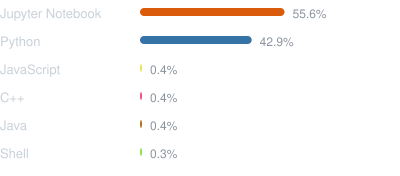

# Aakanksha Duggal

**Principal Data Scientist** · Red Hat · Boston, MA

Building agentic AI frameworks and making production AI accessible on hybrid cloud — in open source.

---

### Where I contribute

<!-- CONTRIBUTIONS -->
[**InstructLab**](https://github.com/instructlab) — Synthetic data generation & LLM alignment

[**Red Hat Emerging Technologies**](https://github.com/redhat-et) — Applied research & tooling

[**OGX**](https://github.com/ogx-ai) — Open-source AI agents

[**Exgentic**](https://github.com/exgentic) — Agentic AI frameworks

[**MLflow**](https://github.com/mlflow) — ML lifecycle & experiment tracking

[**Open Data Hub**](https://github.com/opendatahub-io) — Open source AI/ML platform on Kubernetes
<!-- /CONTRIBUTIONS -->

---

### Languages & tools

<!-- LANGS -->

<!-- /LANGS -->

---

### Connect

[LinkedIn](https://www.linkedin.com/in/duggalaakanksha/) · [Email](mailto:aduggal@redhat.com)

---

<!-- UPDATED -->
*Last updated: 2026-06-09*
<!-- /UPDATED -->
